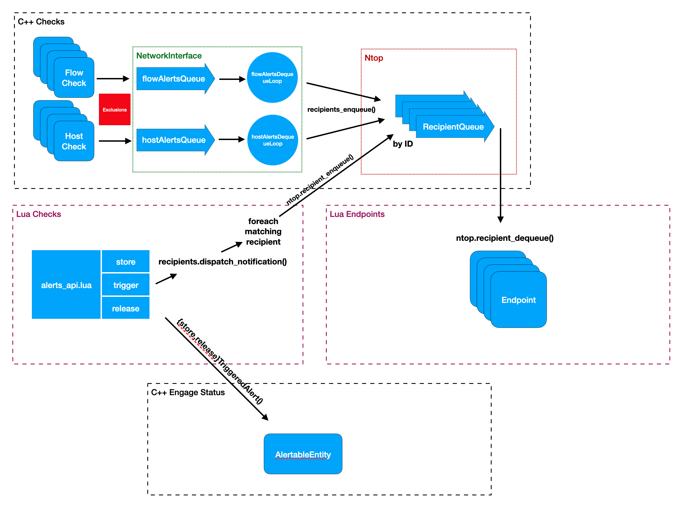

# Introduction

# Alerts Architecture

Alerts in ntopng are triggered from C++ (Flow and Host alerts) or from Lua (all other alert types).
Flow and Host alerts are triggered from C++ for performance reasons, as Lua checks would affect the
performance if every single flow or host has to be evaluated, multiple times during the lifecycle.

The below picture summarizes the interactions between C++ and Lua, and the involved queues.

Note that the database (built-in recipient) is directly connected to one of the recipients queue (the
first one). There is a "alert_store_db" endpoint which is taking care of inserting alerts into the
database (see the alert_store.lua and subclasses). The only exception is with flow alerts when clickhouse 
is enabled: in this case flow alerts are no longer enqueues to the recipient queue for the database, 
as they are a view on the flows table (historical flows stored on clickhouse).

# Stateless vs Stateful

ntopng alerts are

- stateful
- stateless

# Stateless alerts

Stateless alerts are `stored` when an issue is detected. Issues which trigger stateless alerts have no duration associated, that is, they are basically events such as the connection/disconnection of a device, or the change of the status of an SNMP device port.

To store a stateless alert, method `alerts_api.store` is called.

## Stateless alerts lifecycle

1. `alerts_api.store` enqueues the alert into ~~the ntopng internal SQLite queue (`ntop.pushSqliteAlert`) and also into~~ the ntopng recipients queue (`ntop.pushAlertNotification`).
2. `housekeeping.lua` dequeues, every three seconds, the alert from the ~~ntopng internal SQLite queue (`ntop.popSqliteAlert`) and also from the~~ ntopng recipients queue (`alert_utils.processAlertNotifications`).

  - ~~Alerts dequeued from the ntopng internal SQLite queue are sent to the C engine for the actual insertion into SQLite (`interface.storeAlert`).~~
  - Alerts dequeued from the ntopng recipients queue are enqueued again into per-recipient queues (`notification_recipients.dispatchNotification`), using the host pool id carried inside the alert to choose the recipients (`recipients = pools:get_recipients(message.pool_id)`). Alerts are always enqueued also into the builtin SQLite recipient `builtin_sqlite_recipient`.

3. `housekeeping.lua` dequeues, every three seconds, alerts from every per-recipient queue (`notification_recipients.processNotifications`).

  - Alerts are dequeued from the per-recipient queue with a single call to `m.dequeueRecipientAlerts` which is also in charge of processing the dequeued alerts (e.g., batch and send them out in email messages).

# Stateful alerts

Stateful alerts are `trigger`ed the issue is detected, and are `release`d when the issue no longer occurs. Issues which trigger stateful alerts have a duration associated, that is, they are events such as threshold crosses (e.g., the throughput is above 1Mbps) or suspicious activities (e.g., the host is performing a TCP scan).

Methods `alerts_api.trigger` and `alerts_api.release` are called to trigger and release stateful alerts, respectively.

## Stateful alerts lifecycle

1. `alerts_api.trigger` sets into the C core, straight into the entity, the triggered alert (e.g., `host.storeTriggeredAlert`) and enqueues the alert into the ntopng recipients queue (`ntop.pushAlertNotification`). No ~~SQLite~~ enqueues/dequeues/insertions comes into play.
2. `alerts_api.release` removes from the C core the previously triggered alert (e.g., `host.releaseTriggeredAlert`), enqueues the alert into ~~the ntopng internal SQLite queue (`ntop.pushSqliteAlert`) and also into ~~the ntopng recipients queue (`ntop.pushAlertNotification`).
3. `housekeeping.lua` performs the very same operations *2 and 3* described above for stateless alerts.

# Alert Queues

Queues are used to decouple the dispatch from the processing of alerts. Currently used queues are:

- ~~One in-memory queue for SQLite alerts (`ntop->getSqliteAlertsQueue()`)~~
- One in-memory queue for the ntopng recipients (`ntop->getAlertsNotificationsQueue()`)
- Multiple Redis queues for per-recipient queues (`get_endpoint_recipient_queue(recipient_id)`)

## Queue messages format

JSON messages are queued/dequeued. The format of the JSON is undocumented and contains variable-fields which depends on the alert type. However, a minimum set of fields is constant and include alert type, entity and severity.

## Queue drops

- ~~When the SQLlite queue is full, alerts are dropped and counted into the system interface dropped alerts (`iface->incNumDroppedAlerts(1)`).~~
- When the ntopng recipients queue is full, alerts are dropped and counted into the system interface dropped alerts (`iface->incNumDroppedAlerts(1)`) ~~but drops are NOT counted.~~
- When any of the per-recipient queues is full, alerts are dropped with a queue trim but drops are NOT counted.

# Alert Recipients

Recipients are implemented as plugins, e.g., `plugins/{email,webhook}_alert_endpoint/`. Recipients are loaded in memory with `plugins_utils.getLoadedAlertEndpoints()`. A `require` is used to avoid loading them more than one time per Lua VM. Recipients are not loaded when enqueuing alerts, however, they are loaded when dequeuing alerts in `housekeeping.lua` which VM is re-used and only recreated once every two minutes.

It would be desirable to migrate current recipients implementation to an OO implementation to ease the monitoring of queue fill levels.

# Critical Points

- Only one in-memory queue is used for SQLite alerts and ntopng recipients.

  - An interface generating many alerts can jeopardize the queue and cause other interfaces alerts to be dropped.
  - An high number of alerts of a certain type can jeopardize the queue and cause alerts of other types to be dropped.
  
- When ~~the ntopng recipients queue or~~ any of the per-recipient queues is full, alerts are dropped but drops are NOT counted.
- `housekeeping.lua` is assumed to run every three seconds, however, it can be much slower than this, for example when it starts refreshing/downloading blacklists from the web. If the housekeeping gets stuck for a long time, alerts will not be dequeued, queues will grow, and eventually this will cause alert drops.
- ~~`notification_recipients.processNotifications` relies on `housekeeping.lua` running every three seconds (`(now % m.EXPORT_FREQUENCY) < periodic_frequency`). This is assumption is wrong and can cause alerts to stay in per-recipient queues indefinitely.~~
- `notification_recipients.processNotification` relies on `dequeueRecipientAlerts`. If `dequeueRecipientAlerts` is slow, or perform only one operation at time, then alerts will be processed at a much slower rate than the generation rate (e.g., currently, max 1 mail is sent out every minute). It would be ideal to process all recipients in round-robin until there's no more work to do.

